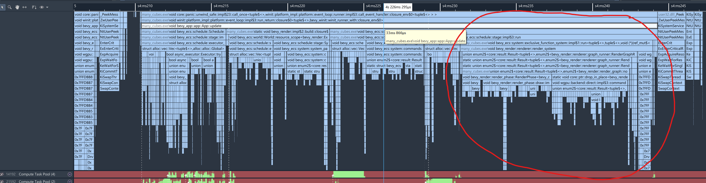

Let's dive into the performance of the Bevy's renderer. Where does time on the CPU go?

<!--more-->

One of my favorite things to do at work is to optimize the performance of our Rust data engine.
So why not take a deeper look at [Bevy's](https://github.com/bevyengine/bevy) renderer performance and see what I might find?

# Many Cubes Benchmark

Bevy has a built-in benchmark called `many_cubes`, which spawns many objects of a single color to test draw call performance.




We'll run this with `cargo build --profile release-with-debug --features bevy/trace_tracy --example many_cubes -- spheres`.

This particular example doesn't have any lights with shadows enabled. I should probably try some profiles later with shadows enabled, those are probably a significant source of more draw calls with a slightly different path (no material changing). Same goes for the depth prepass, which isn't merged as of me trying this!

# Quick Look In Tracy

Bevy has done a great job making [Tracy](https://github.com/wolfpld/tracy) work great out of the box.



Let's get a quick feel for where the renderer related time is being spent at a high level, which can we pull from Tracy's "Find Zone" box.

```
Median Times

Frame: 20.3ms

PostUpdate: 2.65ms
    View visibility: 1.08ms 

Extract: 4.87ms
    extract_meshes (system); 1.99ms
    extract_meshes (commands): 1.74ms
    extract_visible<StandardMat> (commands): 0.55ms

Prepare: 3.77ms
    prepare_uniform_components<MeshUniform> (system): 1.22ms
    prepare_uniform_components<MeshUniform> (commands): 2.33ms

Queue: 1.03ms
    queue_material_meshes: 0.79ms

Sort: 0.23ms

Render: 6.66ms
    main_opaque_pass_3d: 6.66ms
```

So it looks like `main_opaque_pass_3d` is a good candidate for a first look.

# Diving Deeper With Superluminal

Unfortunately, `main_opaque_pass_3d` is a leaf span, so Tracy as setup isn't going to give me any more clues.

Luckily, I have another tool in my toolbox - a sampling profiler. I really like [Superluminal](https://superluminal.eu/), so let's fire that up. This is actually why I built my binary with debug symbols.

Armed with a capture in Superluminal, let's go look at `main_opaque_pass_3d`. Unfortunately, Bevy doesn't integrate with Superluminal yet, so we'll have to find some way to look for it.

{{}}

Zooming around the main thread view, I see the familiar `App::update` call for the frame, and circled in the image below, a group of stacks that mention `RenderGraphRunner`, and walking down a bit I see `main_pass_3d_node::impl$1::run`. Nice, that's probably it, and we can confirm by looking at the source code and seeing the trace label. Superluminal also handily shows where time is going within a function in the source pane, which I've copied here.

```rust
 51 |                  | fn run(
 52 |                  |     &self,
 53 |                  |     graph: &mut RenderGraphContext,
 54 |                  |     render_context: &mut RenderContext,
 55 |                  |     world: &World,
 56 |                  | ) -> Result<(), NodeRunError> {
 57 |                  |     let view_entity = graph.get_input_entity(Self::IN_VIEW)?;
 58 |                  |     let (camera, opaque_phase, alpha_mask_phase, transparent_phase, camera_3d, target, depth) =
 59 |                  |         match self.query.get_manual(world, view_entity) {
 60 |                  |             Ok(query) => query,
 61 |                  |             Err(_) => {
 62 |                  |                 return Ok(());
 63 |                  |             } // No window
 64 |                  |         };
 65 |                  |
 66 |                  |     // Always run opaque pass to ensure screen is cleared
 67 |                  |     {
 68 |                  |         // Run the opaque pass, sorted front-to-back
 69 |                  |         // NOTE: Scoped to drop the mutable borrow of render_context
 70 |                  |         #[cfg(feature = "trace")]
 71 |                  |         let _main_opaque_pass_3d_span = info_span!("main_opaque_pass_3d").entered();
 72 |                  |
 73 |                  |         let mut render_pass = render_context.begin_tracked_render_pass(RenderPassDescriptor {
 74 |                  |             label: Some("main_opaque_pass_3d"),
 75 |                  |             // NOTE: The opaque pass loads the color
 76 |                  |             // buffer as well as writing to it.
 77 |                  |             color_attachments: &[Some(target.get_color_attachment(Operations {
 78 |                  |                 load: match camera_3d.clear_color {
 79 |                  |                     ClearColorConfig::Default => {
 80 |                  |                         LoadOp::Clear(world.resource::<ClearColor>().0.into())
 81 |                  |                     }
 82 |                  |                     ClearColorConfig::Custom(color) => LoadOp::Clear(color.into()),
 83 |                  |                     ClearColorConfig::None => LoadOp::Load,
 84 |                  |                 },
 85 |                  |                 store: true,
 86 |                  |             }))],
 87 |                  |             depth_stencil_attachment: Some(RenderPassDepthStencilAttachment {
 88 |                  |                 view: &depth.view,
 89 |                  |                 // NOTE: The opaque main pass loads the depth buffer and possibly overwrites it
 90 |                  |                 depth_ops: Some(Operations {
 91 |                  |                     // NOTE: 0.0 is the far plane due to bevy's use of reverse-z projections.
 92 |                  |                     load: camera_3d.depth_load_op.clone().into(),
 93 |                  |                     store: true,
 94 |                  |                 }),
 95 |                  |                 stencil_ops: None,
 96 |                  |             }),
 97 |                  |         });
 98 |                  |
 99 |                  |         if let Some(viewport) = camera.viewport.as_ref() {
100 |                  |             render_pass.set_camera_viewport(viewport);
101 |                  |         }
102 |                  |
103 | 53%  (5ms 883µs) |         opaque_phase.render(&mut render_pass, world, view_entity);
104 | 46%  (5ms 110µs) |     }
```
